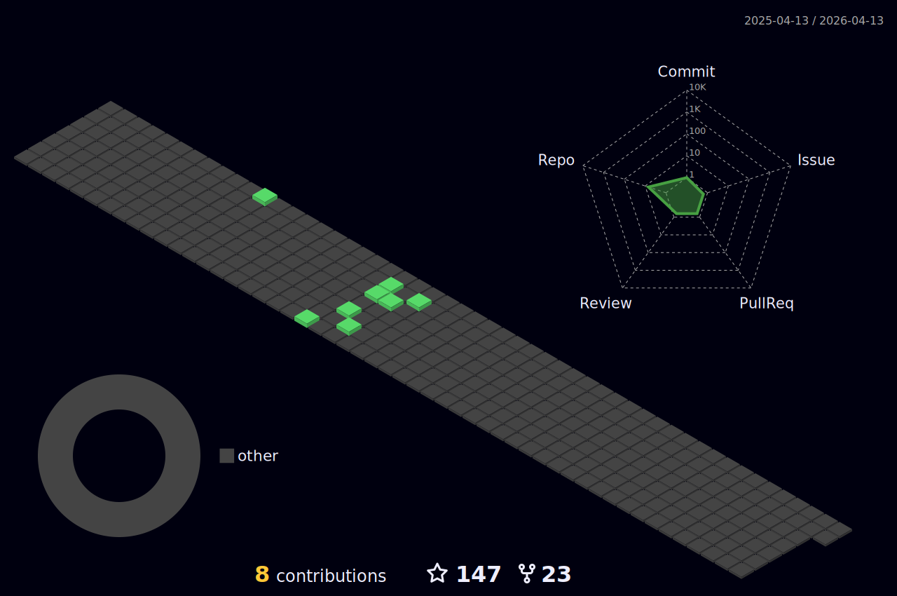

<!--- ------------------------------------------------------------------------------------------------------------------------------------------------------ -->
<!--- -- Custom Designed Banner ---------------------------------------------------------------------------------------------------------------------------- -->
<!--- ------------------------------------------------------------------------------------------------------------------------------------------------------ -->

<!--- ------------------------------------------------------------------------------------------------------------------------------------------------------ -->
<!--- -- Visitor Badge + Links ----------------------------------------------------------------------------------------------------------------------------- -->
<!--- ------------------------------------------------------------------------------------------------------------------------------------------------------ -->

  
    
  
<!--    -->
  
  
  
  

 

<!--- ------------------------------------------------------------------------------------------------------------------------------------------------------ -->
<!--- -- About ME  --------------------------------------------------------------------------------------------------------------------------------------- -->
<!--- ------------------------------------------------------------------------------------------------------------------------------------------------------ -->
 
 </a>
 

My name is 𝐒𝐚𝐜𝐡𝐢𝐧 𝐒𝐢𝐧𝐠𝐡.I’m a dedicated learner who enjoys solving problems and trying new things. I work well both in teams and on my own, and I am always ready for new challenges. With experience in automation and troubleshooting, I also have strong skills in leading teams. I’m excited to use my abilities in creative and dynamic projects..

### 
My Technical Skills

  

  

<i>&nbsp; Work with Optimism, Hope for the Best!</i>  

👋 Hello and thanks for stopping by! I’m Sachin Singh, a passionate DevOps and Cloud Engineer from India, on a mission to turn tech challenges into exciting innovations.  🌟

🎓&nbsp; I am currently pursuing a Bachelor of Technology in Computer Science, where I serve as a college class representative. In this role, I’ve led and organized various club activities, focusing on teaching juniors essential DevOps and cloud concepts such as AWS, Linux, Docker, Kubernetes, and automation.

🏆 As a Technical Volunteer at [LinuxWorld Informatics Pvt Ltd](https://www.lwindia.com/), I lead over 1,000+ online and offline learners in technologies like DevOps, Cloud, Artificial Intelligence, and Generative AI. My role involves solving and troubleshooting student issues, ensuring their learning journey is smooth and successful.

🔥 I have over **30K+** followers on [LinkedIn](https://www.linkedin.com/in/sa-chin/) I’m dedicated to helping learners succeed. I post daily to motivate and encourage my audience, sharing valuable resources like interview questions, career roadmaps, cheat sheets, and personal growth tips. My goal is to make the learning journey smooth and rewarding for everyone.

✍️ I write articles on [medium](https://medium.com/@sachin28). about use cases in different industries and technologies. Whenever I work on a project, I document each step in detail. My goal is to provide clear references that help others easily understand and complete similar projects.

😄 My biggest strength is my ability to adapt quickly, turning challenges into opportunities. I’m also very passionate about learning new things, which helps me push limits, embrace new ideas, and achieve results that go beyond what’s expected.

🧟‍♂️ I believe in using empathy to work well with others and understand different perspectives. One challenge I face is that I focus deeply on one project at a time, which can make it hard for me to switch to other tasks until the current one is done.

 
 

  
🏆 Certificates

   

 **A journey of my skills and expertise** across various DevOps, cloud, and cutting-edge technologies, gained through my dedication and hard work at [LinuxWorld Informatics Pvt. Ltd](https://www.linkedin.com/company/linuxworld-informatics-pvt-ltd) and other renowned companies [Oracle University](https://www.linkedin.com/company/oracle/posts/?feedView=all) etc. Every certificate **represents a milestone** in my path of continuous learning! 🌟

 

| S.No. | Certificate Name | Issuing Authority | Date | Credential |
|:-----:|:-----------------|:------------------:|:----:|:----------:|
| 1. |  ARTH 3.0| LinuxWorld Informatics Pvt. Ltd. | August 2023 | [View](https://drive.google.com/file/d/1K08l2BEJ-S-Tjp6tjDwbq809f_ivKIIj/view?usp=drive_link) |
| 2. | Summer Internship | LinuxWorld Informatics Pvt. Ltd. | September 2023 | [View](https://drive.google.com/file/d/1aUe5Ss4zciWr0j6zVxNaEhg282E0LIoc/view?usp=sharing) |
| 3. | JAZBAA 2.0  | LinuxWorld Informatics Pvt. Ltd. | November 2023 | [View](https://drive.google.com/file/d/1N-7ezgsLDfTTzlk56fkyQmuVz-wk-uZp/view?usp=sharing) |
| 4. | Industry Relevant AWS Training | LinuxWorld Informatics Pvt. Ltd. | May 2023 | [View](https://drive.google.com/file/d/1hQ4LNhQLzXRxxZ7JgDphQJGA1DeI8-Hy/view?usp=sharing) |
| 5. | Jenkins CI/CD using Pipeline | LinuxWorld Informatics Pvt. Ltd. | January 2023 | [View](https://drive.google.com/file/d/1Ejuu7zk8_ArFW8lL76iAdzk7gIJvUnn1/view?usp=sharing) |
| 6. | Specialization in Container | LinuxWorld Informatics Pvt. Ltd. | April 2023 | [View](https://drive.google.com/file/d/1bKdEXZLy0XkmBgbaSULaRTGEKzKa15Wq/view?usp=sharing) |
| 7. | Bash Shell Scripting | LinuxWorld Informatics Pvt. Ltd. | January 2023 | [View](https://drive.google.com/file/d/1lK9oBWLS7CGxXKJMZOiNMTdetj1y88y1/view?usp=sharing) |
| 8. | MongoDB - NoSQL | LinuxWorld Informatics Pvt. Ltd. | April 2023 | [View](https://drive.google.com/file/d/1HLE4lE1mdDYtpGGoGdr5rQuenfN99dDV/view?usp=sharing) |
| 9. | Monitoring using Prometheus & Grafana | LinuxWorld Informatics Pvt. Ltd. | May 2023 | [View](https://drive.google.com/file/d/1EzO6o6RLfXqa2NBxwtN2lQeMF5Dy1sIW/view?usp=sharing) |
| 10. | Managing Infrastructure using Terraform | LinuxWorld Informatics Pvt. Ltd. | February 2023 | [View](https://drive.google.com/file/d/1-jNEpuTT_ejSiZCtuouBHEMCvRYJqpsY/view?usp=sharing) |
| 11. | Specialization in Data Science program | LinuxWorld Informatics Pvt. Ltd. | June 2023 | [View](https://drive.google.com/file/d/16OB5BpfLHIomVgyDGVxkraTp9_VQ7YmH/view?usp=drive_link) |
| 12. | MYSQL Database Training | LinuxWorld Informatics Pvt. Ltd. | December 2023 | [View](https://drive.google.com/file/d/1M-uPPNoCtHc-BVcSXA326cwP537jLgFw/view?usp=sharing) |
| 13. | Mastering Git and Github Program | LinuxWorld Informatics Pvt. Ltd. | January 2023 | [View](https://drive.google.com/file/d/1dwfoDNn5y4DwLap0Qt2YncGad8-x-E-m/view?usp=sharing) |
| 14. | Gitlab CI-CD Pipeline Training | LinuxWorld Informatics Pvt. Ltd. | October 2023 | [View](https://drive.google.com/file/d/16sdXKr6A1wK_RKOJy7hUsvoiuTdoRnfp/view?usp=sharing) |
| 15. | AWS Solution Architect CSA Program | LinuxWorld Informatics Pvt. Ltd. | April 2023 | [View](https://drive.google.com/file/d/11gOQXUYMmelsOwlXVFGA7in2TGMaahHi/view?usp=sharing) |
| 16. | Oracle Certified DevOps professional | Oracle University  | September 2023 | [View](https://drive.google.com/file/d/1CREAahcOkuvo_pkkljBit2Ueooy3UsQc/view?usp=sharing) |
| 17. | Aws cloud and Artificial Intelligence| LinuxWorld Informatics Pvt. Ltd. | August 2023 | [View](https://drive.google.com/file/d/1qcsCfJtuBqRbOZdmgLZr0kWMZ-EDtZEN/view?usp=sharing) |
| 18. |  Blockchain Masterclass | LinuxWorld Informatics Pvt. Ltd. | September 2023 | [View](https://drive.google.com/file/d/1H6z3LYOcH5vsApTYMd-ttGy5cqdn-U_N/view?usp=sharing) |
| 19. | Multicloud Architect Associate| Oracle University | September 2023 | [View](https://drive.google.com/file/d/1JFI6ddD-a8WvHSMoDqAQc8DX_yln0Hal/view?usp=sharing) |
| 20. | AWS Builders series | AWS | July 2023 | [View](https://drive.google.com/file/d/1XqoTOskUw_FI-9GGb8rNIdxPbkMV3y3Z/view?usp=sharing) |
| 21. | Oracle certified Developer Professional| Oracle University | October 2023 | [View](https://drive.google.com/file/d/1-Lwol03lzwf0OIMwZYjSvo3DyBOzZXiR/view?usp=sharing) |
| 22. | Tree planting Certificate | Hacktoberfest | October 2023 | [View](https://drive.google.com/file/d/16JPfoAjnZQEIK-XNySgRhECTrRin93qT/view?usp=sharing) |
| 23. | Data Science Professional | Oracle University | September 2023 | [View](https://drive.google.com/file/d/1PsQoke1ZKp4pnHvkcJg0otXGY5hcgsSs/view?usp=sharing) |
| 24. | Cloud Developer Certified Professional | Oracle University | September 2023 | [View](https://drive.google.com/file/d/1GYK_Ul5FddKnMxfByMES9spn1ayzLnbK/view?usp=sharing) |
| 25. | LinkedIn Marketing Solutions Fundamentals | LinkedIn | October 2023 | [View](https://drive.google.com/file/d/1JRZyTYg6-QHBU5Y1WmDVLRWhxEWc-sQu/view?usp=sharing) |

  

 
 

## Latest Blog Posts  

 

<!-- BLOG-POST-LIST:START -->
- [Real application industry-based project on DevOps ♾️](https://medium.com/@sachin.singh.professional/real-application-industry-based-project-on-devops-b3764c9688b2)
- [The Algorithms Behind The Working Of Google Maps📍](https://medium.com/@sachin.singh.professional/the-algorithms-behind-the-working-of-google-maps-73c379bcc9b9)
- [Deploying WordPress Application on Ec2 Instance with AWS RDS 🌻](https://medium.com/@sachin.singh.professional/deploying-wordpress-application-on-ec2-instance-with-aws-rds-bb1466416d28)
- [Deep Research on Artificial Intelligence and Machine Learning 🤖](https://medium.com/@sachin.singh.professional/deep-research-on-artificial-intelligence-and-machine-learning-14f27d7ca5b0)
- [Case Study of How Netflix got benefits from Amazon Web Services 🍿](https://medium.com/@sachin.singh.professional/case-study-of-how-netflix-got-benefits-from-amazon-web-services-53d3ad0256bd)
- [Microservices Design principle and Design Patterns 💐 ](https://medium.com/@sachin.singh.professional/microservices-design-principle-and-design-patterns-879ab5e8dad3)
<!-- BLOG-POST-LIST:END -->

<!------------------   -------------------------------------------------------------------- -->
<!---------------- Recommend Blog Post ----------------------------------------------------- -->
<!---------------------  ------------------------------------------------------------------- -->

<!------------------   -------------------------------------------------------------------- -->
<!----------------[END] Recommend Blog Post ----------------------------------------------------- -->
<!---------------------  ------------------------------------------------------------------- -->

<samp>Trying to touch and learn 1 new thing every day!</samp>
---

# Tech Stack  

 <samp>Tools & Technologies</samp> |  <samp>Badge</samp> |
--- | --- |
<samp>DevOps</samp> |      |
<samp>Cloud Platforms </samp>|    |
<samp>Operating System</samp> |       
<samp>Programming Languages</samp> |   |
<samp>Frameworks</samp> |  |
<samp>IDE</samp> |  | 
<samp>Version Control</samp> |  |
<samp>Servers</samp> |  |
<samp>Databases</samp> | |

<!--- ------------------------------------------------------------------------------------------------------------------------------------------------------ -->
<!--- -- Activity Graph ------------------------------------------------------------------------------------------------------------------------------------ -->
<!--- ------------------------------------------------------------------------------------------------------------------------------------------------------ -->

 

                     
 

<!--- ------------------------------------------------------------------------------------------------------------------------------------------------------ -->
<!--- -- My Socials ---------------------------------------------------------------------------------------------------------------------------------------- -->
<!--- ------------------------------------------------------------------------------------------------------------------------------------------------------ -->

#  The Online Hangout

  
   
  
   
    
  
  
   
   
  
  
  <a href="https://discord.com/channels/@me">
  

<!--
  

  

 
-->

   

# Github Stats

<!-- ---------------------------------------STATS------------------------------------------
--------------------------------------------------------------------------------------------- -->

                

        
<!-- ---------------------------------------STATS------------------------------------------
--------------------------------------------------------------------------------------------- -->      
        

       

  

  
  
  
  <a href="https://github.com/sachin2815">

<!-- ---------------------------------------3D Contributor------------------------------------------
--------------------------------------------------------------------------------------------- -->

<h1> CONTRIBUTIONS</h1>
 

        

  <!--- ------------------------------------------------------------------------------------------------------------------------------------------------------ -->
<!--- -- Snake Contribution Graph -------------------------------------------------------------------------------------------------------------------------- -->
<!--- ------------------------------------------------------------------------------------------------------------------------------------------------------ -->

  

  

