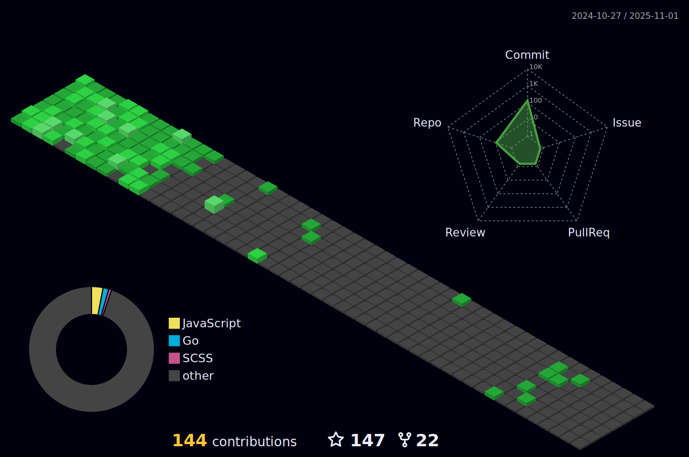

<!--- ------------------------------------------------------------------------------------------------------------------------------------------------------ -->
<!--- -- Custom Designed Banner ---------------------------------------------------------------------------------------------------------------------------- -->
<!--- ------------------------------------------------------------------------------------------------------------------------------------------------------ -->

<!--- ------------------------------------------------------------------------------------------------------------------------------------------------------ -->
<!--- -- Visitor Badge + Links ----------------------------------------------------------------------------------------------------------------------------- -->
<!--- ------------------------------------------------------------------------------------------------------------------------------------------------------ -->

  
    
  
<!--    -->
  
  
  
  

 

<!--- ------------------------------------------------------------------------------------------------------------------------------------------------------ -->
<!--- -- About ME  --------------------------------------------------------------------------------------------------------------------------------------- -->
<!--- ------------------------------------------------------------------------------------------------------------------------------------------------------ -->
 
 </a>
 

My name is 𝐒𝐚𝐜𝐡𝐢𝐧 𝐒𝐢𝐧𝐠𝐡.I’m a dedicated learner who enjoys solving problems and trying new things. I work well both in teams and on my own, always ready for new challenges. With experience in automation and troubleshooting, I also have strong skills in leading teams. I’m excited to use my abilities in creative and dynamic projects..

### 
My Technical Skills

  

  

<i>&nbsp; Work with Optimism, Hope for the Best!</i>  

👋 Greetings! It's great to have you here. I'm Azfar Alam, an enthusiastic DevOps Engineer hailing from India.

🚀 As the Founder of [HelpOps-Hub](https://www.helpopshub.com/), I created HelpOps-Hub to prevent anyone from getting stuck in DevOps. When I was learning DevOps, I encountered many errors with various tools and technologies that I couldn't solve by myself. It took a lot of time to resolve these issues, so I created HelpOps-Hub to save others from wasting their time on these errors. As the founder of HelpOps-Hub, I invite everyone to join our platform, share their experiences with DevOps tools and technologies, provide solutions to errors, and learn how to resolve issues quickly.

🎯 As the Co-Founder of [Emanate](https://emanate.co.in), I've driven the creation of a pioneering platform that reimagines how investors and startups collaborate. Emanate isn't just a platform; it's a dynamic community and vital funding contributions. Our innovative concept introduces the “First Social Media Platform for Investor and Startups,” Empowering investors with comprehensive insights into registered startups.

🏆 As a Technical Volunteer at [LinuxWorld Informatics Pvt Ltd](https://www.lwindia.com/), I lead 25+ online learners orchestrating tasks, teaching DevOps, and enhancing skills in CI/CD, and cloud tech. Beyond leadership, I thrive as a troubleshooter, unraveling technical challenges and leaving a lasting impact on careers.

🎓 &nbsp; I'm pursuing Bachelor of Technology with a degree in Computer Science, and also maintaining [Emanate: Sharing Startup Dreams](www.emanate.co.in).

🔥 &nbsp; With an impressive following of 10k+ on [Linkedin](https://www.linkedin.com/in/md-azfar-alam/), I post a lot of DevOps technology content, various technology-related projects, and ideas for integrating different technologies.

🔖 &nbsp; I am busy writing articles on use cases across various industries and technologies on [medium](https://medium.com/@azfaralam).

🔥 &nbsp; I also write my articles on [Hashnode](https://azfaralam.hashnode.dev/) so that I don't face any problems in the future. For example, if I learn something new in DevOps technology today, I write the whole thing step-by-step in my [Hashnode blog article](https://azfaralam.hashnode.dev/) with screenshots so that I can refer to it in the future and understand it immediately. It can help others too.

😄 &nbsp; My standout strength lies in my unwavering adaptability—a dynamic force that transforms challenges into opportunities. Coupled with a relentless passion for continuous learning, I thrive in pushing boundaries, embracing innovation, and consistently delivering results that exceed expectations. 

🎁 Empathy is my compass—guiding collaboration, fostering understanding, and creating a harmonious tapestry in every interaction.

## Latest Blog Posts  

 

<!-- BLOG-POST-LIST:START -->
- [How Industries are Solving challenges using Ansible?](https://medium.com/@azfaralam/how-industries-are-solving-challenges-using-ansible-53c951ce105)
- [How is Kubernetes used in industries, and what use cases are solved by Kubernetes?](https://medium.com/@azfaralam/how-is-kubernetes-used-in-industries-and-what-use-cases-are-solved-by-kubernetes-1692ba4b13cc)
- [Mapping Industry Landscapes: A Comprehensive Study on Jenkins Adoption Across Companies!](https://medium.com/@azfaralam/mapping-industry-landscapes-a-comprehensive-study-on-jenkins-adoption-across-companies-bcfafb4e91d)
- [Transforming Industries: The Power of Natural Language Processing (NLP) in the Age of AI](https://medium.com/@azfaralam/transforming-industries-the-power-of-natural-language-processing-nlp-in-the-age-of-ai-b159a0738344)
- [OpenShift Use Cases | Real-Time Industry Based Case Studies | Why Openshift](https://medium.com/@azfaralam/openshift-use-cases-real-time-industry-based-case-studies-fff064af0e3b)
- [Mastering Prompt Engineering: Optimizing Conversations with ChatGPT](https://medium.com/@azfaralam/unlocking-the-power-of-chat-gpt-through-effective-prompt-engineering-2d72c3655e03)
<!-- BLOG-POST-LIST:END -->

<!------------------   -------------------------------------------------------------------- -->
<!---------------- Recommend Blog Post ----------------------------------------------------- -->
<!---------------------  ------------------------------------------------------------------- -->

<!------------------   -------------------------------------------------------------------- -->
<!----------------[END] Recommend Blog Post ----------------------------------------------------- -->
<!---------------------  ------------------------------------------------------------------- -->

<samp>Trying to touch and learn 1 new thing everyday!</samp>
---

# Tech Stack  

 <samp>Tools & Technologies</samp> |  <samp>Badge</samp> |
--- | --- |
<samp>DevOps</samp> |      |
<samp>Cloud Platforms </samp>|    |
<samp>Operating System</samp> |       
<samp>Programming Languages</samp> |     |
<samp>Frameworks</samp> | |
<samp>IDE</samp> |   | 
<samp>Version Control</samp> |  |
<samp>Servers</samp> |  |
<samp>Databases</samp> | |

<!--- ------------------------------------------------------------------------------------------------------------------------------------------------------ -->
<!--- -- Activity Graph ------------------------------------------------------------------------------------------------------------------------------------ -->
<!--- ------------------------------------------------------------------------------------------------------------------------------------------------------ -->

 

                     
 

<!--- ------------------------------------------------------------------------------------------------------------------------------------------------------ -->
<!--- -- My Socials ---------------------------------------------------------------------------------------------------------------------------------------- -->
<!--- ------------------------------------------------------------------------------------------------------------------------------------------------------ -->

#  The Online Hangout

  
   
  
   
    
  
  
   
   
  
  
  <a href="https://discordapp.com/users/877531143610708028">
  

<!--
  

  

 
-->

   

# Github Stats

<!-- ---------------------------------------STATS------------------------------------------
--------------------------------------------------------------------------------------------- -->

                

        
<!-- ---------------------------------------STATS------------------------------------------
--------------------------------------------------------------------------------------------- -->      
        
          

       

  

  
  
  
  <a href="https://github.com/mdazfar2">

  

<!-- ---------------------------------------3D Contributor------------------------------------------
--------------------------------------------------------------------------------------------- -->

<h1> CONTRIBUTIONS</h1>
 

        

  <!--- ------------------------------------------------------------------------------------------------------------------------------------------------------ -->
<!--- -- Snake Contribution Graph -------------------------------------------------------------------------------------------------------------------------- -->
<!--- ------------------------------------------------------------------------------------------------------------------------------------------------------ -->

  

